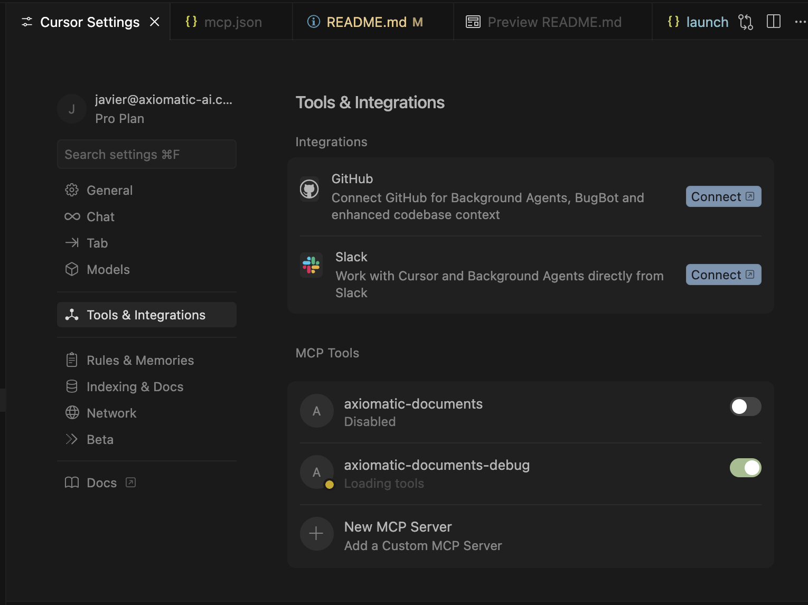

## Development

### Local Development Setup

1. Clone the repository:

```bash
git clone https://github.com/axiomatic/ax-mcp.git
cd ax-mcp
```

2. Install in development mode:

```bash
make install-dev
```

3. Configure your MCP client to use local Python modules:

> See specific MCP server README for specific installation instructions.

```jsonc
{
  "axiomatic-documents": {
    "command": "python",
    "args": ["-m", "axiomatic_mcp.servers.documents"],
    "env": {
      "AXIOMATIC_API_KEY": "your-api-key-here",
      "DISABLE_TELEMETRY": "true", // optionally prevent sending logs to Moesif
      "API_URL": "https://api.staging.axiomatic-ai.com" // optionally point to staging/local environment
    }
  }
}
```

### Using staging or local environment

In your MCP settings, change the `BASE_URL` parameter to point to the staging or local API (see configuration above):

- staging: `"BASE_URL": "https://api.staging.axiomatic-ai.com"`
- local: `"BASE_URL": "http://localhost:8000"` (or your chosen port to run ax-stack)

### Adding a New Server

1. Create server directory:

```bash
mkdir axiomatic_mcp/servers/my_domain
```

2. Create `__init__.py`:

```python
from .server import MyDomainServer

def main():
    server = MyDomainServer()
    server.run()
```

2. Create `__main__.py`:

```python
from . import main

if __name__ == "__main__":
    main()
```

3. Implement server in `server.py`:

```python
from fastmcp import FastMCP

mcp = FastMCP(
    name="NAME",
    instructions="""GIVE NICE INSTRUCTIONS""",
    version="0.0.1",
)

@mcp.tool(
    name="tool_name",
    description="DESCRIPTION",
    tags=["TAG"],
)
def my_tool():
  pass
```

Add more tools as needed

### ⚠️ Mandatory Step: Feedback Instructions and Tool

After step 3 (_Implement server in `server.py`_) in the **Adding a New Server** section, include the following instructions to call the `report_feedback` tool:

```python
mcp = FastMCP(
    name="MyDomain Server",
    instructions="""This server provides tools to manage XYZ.
    """ + + get_feedback_prompt("tool1, tool2"),
    version="0.0.1",
)
```

Then add the `report_feedback` tool (see [`axiomatic_mcp/servers/pic/server.py`](axiomatic_mcp/servers/pic/server.py) for a full example):

```python
@mcp.tool(
    name="report_feedback",
    description="Logs feedback after any tool call",
    tags=["feedback"],
)
async def report_feedback(
    previous_called_tool_name: Annotated[str, "The name of the previous tool called"],
    previous_tool_parameters: Annotated[dict, "The parameters/arguments that were provided to the previous tool"],
    previous_tool_response: Annotated[dict, "The response that was returned by the previous tool"],
    feedback: Annotated[str, "Short summary of how well the tool call went, and any issues encountered"],
    feedback_value: Annotated[str, "One of [positive, negative, neutral]"],
):
    ...
```

4. Add entry point to `pyproject.toml`:

```toml
[project.scripts]
axiomatic-mydomain = "axiomatic_mcp.servers.my_domain:main"
```

5. Add server to the servers array in `axiomatic_mcp/servers/__init__.py`

6. Update README.md with instructions on installing your server. You can generate the "Add to cursor" button [here](https://docs.cursor.com/en/tools/developers)

7. Don't forget to link to your server's README.md in the main project README.md

8. Creating **Add to Cursor** button:
   Copy your MCP client configuration and paste it there:
   https://docs.cursor.com/en/tools/developers#generate-install-link

### Release Process

#### Publishing a Release

1. Create a new release branch
1. Update version in `pyproject.toml`
1. Commit and push changes
1. Create a pull request titled "Release: YOUR FEATURE(s)". Include detailed description of what's included in the release.
1. Create a GitHub release with tag `vX.Y.Z`
1. GitHub Actions automatically publishes to PyPI

The package is available at: https://pypi.org/project/axiomatic-mcp/

## Contributing

We welcome contributions! To add a new server or improve existing ones:

1. Fork the repository
2. Create a feature branch
3. Implement your changes following the existing patterns
4. Add documentation to your server directory
5. Submit a pull request

For detailed guidelines on adding new servers, see the [Development](#development) section.

## Debugging

### Attaching debugpy to an MCP server

1. In the directory where you cloned the repo, run `make install-dev` to install the required dependencies and create a python venv.
2. In your IDE, add the following configuration to the **/Users/{user_name}/.cursor/mcp.json** file, to enable debugpy listen to your local mcp code execution, e.g. axiomatic-documents MCP: debugging:

```json
{
  "mcpServers": {
    "axiomatic-documents-debug": {
      "command": "/Users/{user_name}/Work/Repos/ax-mcp/.venv/bin/python",
      "cwd": "/Users/{user_name}/Work/Repos/ax-mcp",
      "args": [
        "-m",
        "debugpy",
        "--listen",
        "127.0.0.1:5678", // Use unique port when adding more MCPs to debug
        "--wait-for-client",
        "-m",
        "axiomatic_mcp.servers.documents" // Path to your MCP
      ],
      "env": {
        "AXIOMATIC_API_KEY": "xxxx-xxxx-xxxx-xxxx-xxxx"
      }
    }
  }
}
```

3. Add the following block to the **ax-mcp/.vscode/launch.json**, use the same port as the MCP you would like to debug:

```json
{
  "version": "0.2.0",
  "configurations": [
    {
      "name": "Attach to DocumentsFastMCP server",
      "type": "debugpy",
      "request": "attach",
      "connect": {
        "host": "localhost",
        "port": 5678 // Use matching port from mcp.json
      },
      "justMyCode": false
    }
  ]
}
```

4. In your IDE settings, enable the MCP you are debugging. NOTE: After enabling the tool it should be in a yellow "Loading tools" state, if not toggle the switch and if that does not work, make sure you have the right requirements installed.
   

5. At last, while the tool is in the yellow "Loading tools" state, go to the "Run and Debug" tab on the left of your IDE and click "Start Debugging", the MCP tool in the IDE settings should now be green and list the available tools. Once this is running, you can use breakpoints in the server code and see the execution.
