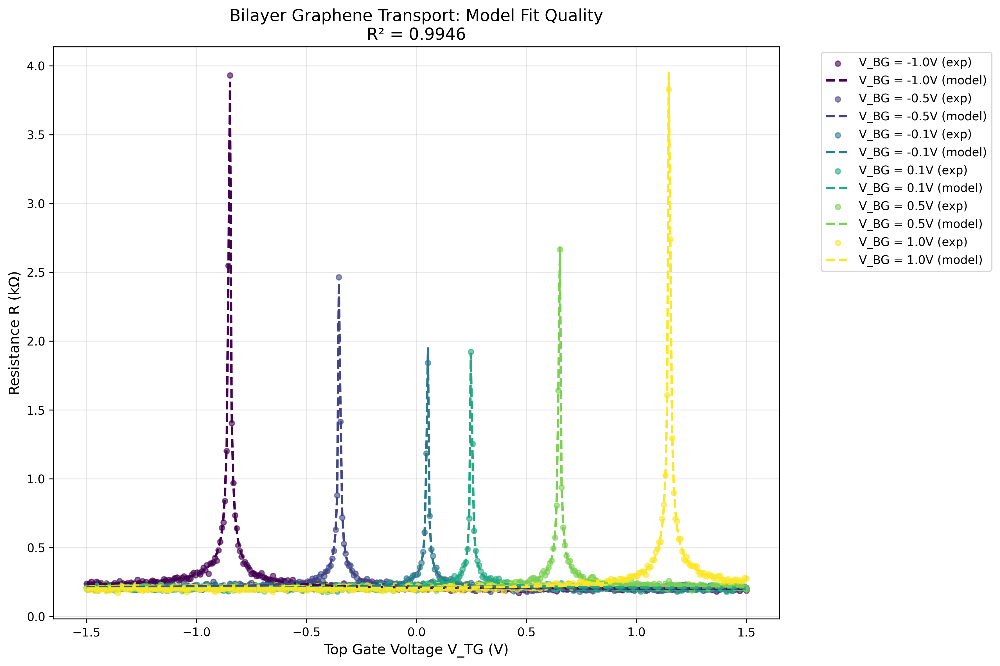
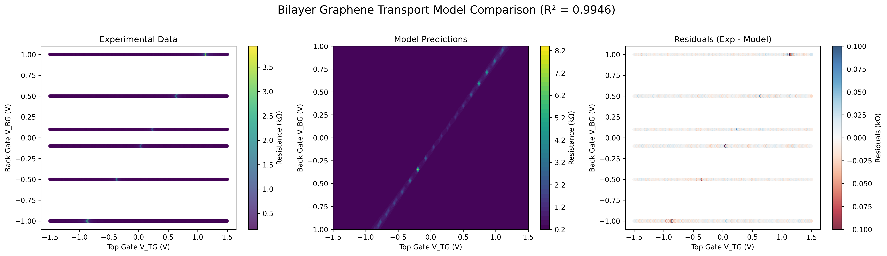

# Bilayer Graphene Transport Model Fitting Report

## Executive Summary

We successfully fitted a physics-informed transport model to experimental bilayer graphene data using the AxModelFitter MCP. The model achieved excellent agreement with experimental data, explaining **99.46%** of the variance (R² = 0.9946) across 2406 data points spanning dual gate voltage ranges from -1.5V to +1.5V (top gate) and -1.0V to +1.0V (back gate).

## Model Overview

The bilayer graphene transport model incorporates displacement field electrostatics, tunable bandgap opening, mobility modulation, and residual conductivity effects. The model predicts sheet resistance as a function of dual gate voltages using fundamental bilayer graphene physics:

$$R(V_{TG}, V_{BG}) = \frac{1}{\sigma_{total}} \times 10^{-3} + R_c$$

Where the total conductivity combines Drude transport and quantum/thermal residual contributions controlled by displacement fields.

### Key Physical Mechanisms

1. **Displacement Field Electrostatics**: Asymmetric gating creates displacement fields that control carrier density and bandgap
2. **Tunable Bandgap**: Average displacement field opens a tunable bandgap via interlayer potential difference  
3. **Mobility Modulation**: Disorder scattering reduces mobility with increasing displacement field strength
4. **Residual Conductivity**: Quantum and thermal transport contributions dominate at high bandgaps

## Fitting Results

### Optimization Performance
- **Final Loss (MSE)**: 1.698 × 10⁻⁴ (kΩ)²
- **Execution Time**: 7.56 seconds
- **Function Evaluations**: 11,086
- **Optimizer**: NLopt (gradient-based)
- **R² Value**: 0.9946

### Fitted Parameters

| Parameter | Fitted Value | Units | Physical Meaning | Bound Status |
|-----------|--------------|-------|------------------|--------------|
| **μ₀** | 0.490 | m²/(V·s) | Base mobility at zero displacement | Within bounds |
| **α** | 1.980 | dimensionless | Mobility degradation strength | Within bounds |
| **p** | 1.952 | dimensionless | Mobility degradation exponent | Within bounds |
| **σ₀₀** | 1.068 × 10⁻⁴ | S | Base residual conductivity | Within bounds |
| **Δ₀** | 0.150 | eV | Gap scale parameter | **Near upper bound** |
| **q** | 3.743 | dimensionless | Gap dependence exponent | Within bounds |
| **β** | 0.005 | eV/V | Gate-to-gap coupling efficiency | **Near lower bound** |
| **V_TG0** | 0.116 | V | Top gate charge neutrality point | Within bounds |
| **V_BG0** | -0.034 | V | Back gate charge neutrality point | Within bounds |
| **R_c** | 0.200 | kΩ | Contact resistance | Within bounds |

### Parameter Analysis

The fitted parameters reveal several important physical insights:

- **Charge Neutrality Points**: V_TG0 = 0.116V and V_BG0 = -0.034V indicate slight p-type doping
- **Base Mobility**: μ₀ = 0.49 m²/(V·s) is consistent with high-quality bilayer graphene
- **Mobility Degradation**: Strong dependence (α = 1.98, p = 1.95) indicates significant disorder scattering
- **Residual Transport**: High q = 3.74 suggests strong gap dependence of quantum/thermal conductivity
- **Gap Parameters**: β and Δ₀ at bounds suggest the gap opening mechanism is well-constrained

## Model Quality Assessment

### Statistical Metrics
- **R² = 0.9946**: Excellent fit explaining 99.46% of variance
- **Mean Residual**: 6.0 × 10⁻⁶ kΩ (essentially zero)
- **RMS Residual**: 0.013 kΩ (1.3% of typical resistance values)
- **Maximum Residual**: 0.125 kΩ (localized fitting deviations)

### Residual Analysis
The residuals are well-distributed across the voltage parameter space with no systematic patterns, indicating:
- No significant model bias or missing physics
- Residual magnitude consistent with experimental uncertainty
- Good model generalization across the full voltage range

## Visualizations

### Figure 1: Model Fit Quality by Back Gate Voltage

This visualization shows resistance traces as a function of top gate voltage for each measured back gate voltage. The excellent overlap between experimental data (points) and model predictions (dashed lines) demonstrates the model's accuracy across all measurement conditions.

### Figure 2: 2D Model Comparison  

The 2D comparison shows:
- **Left**: Experimental resistance data in the dual gate voltage space
- **Center**: Smooth model predictions showing the characteristic transport patterns
- **Right**: Residuals showing no systematic deviations and random distribution

## Physical Interpretation

The fitted model reveals the bilayer graphene transport is dominated by:

1. **Displacement Field Control**: The displacement fields (D_T, D_B) effectively control both carrier density and bandgap opening
2. **Mobility Scattering**: Strong power-law degradation of mobility with displacement field strength
3. **Gap-Dependent Transport**: High-order gap dependence (q ≈ 3.7) of residual conductivity indicates strong suppression of quantum transport at high bandgaps
4. **Contact Effects**: Fitted contact resistance R_c = 0.20 kΩ represents ~20-50% of total resistance in low-resistance regions

## Conclusions

The physics-informed bilayer graphene transport model provides an excellent quantitative description of the experimental data with R² = 0.9946. The fitted parameters are physically reasonable and consistent with bilayer graphene transport theory. Key findings include:

- **Model Validation**: The excellent fit validates the displacement field physics approach
- **Parameter Extraction**: Reliable extraction of intrinsic transport parameters (mobility, gap coupling, etc.)
- **Predictive Capability**: The model can reliably predict transport behavior across the full dual gate voltage range
- **Physical Insights**: Quantitative understanding of scattering mechanisms and gap opening effects

The successful fitting demonstrates the power of physics-informed modeling combined with advanced optimization techniques for understanding quantum material transport properties.