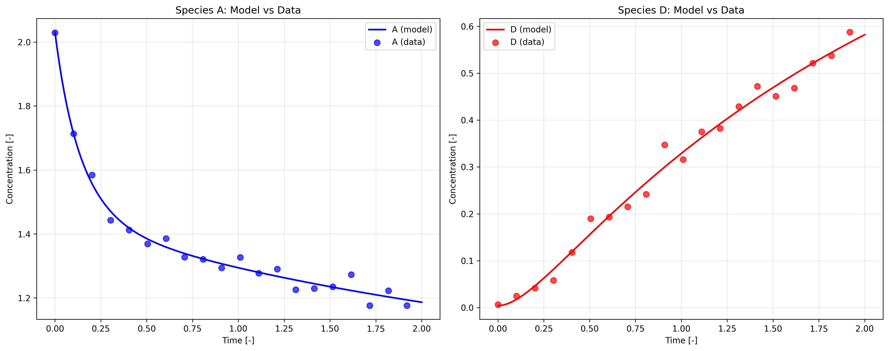
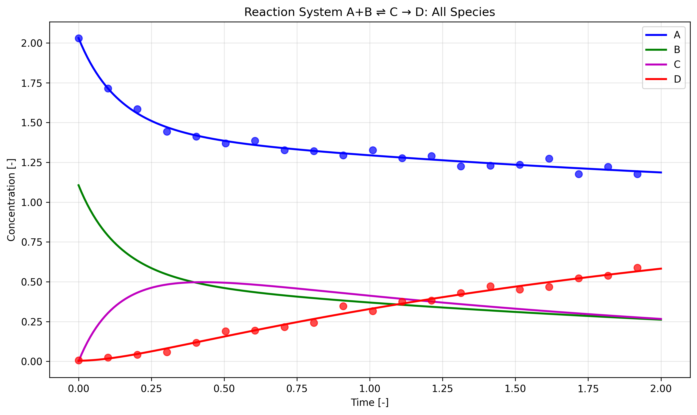

# Reaction System Analysis: A+B ⇌ C → D

## Problem Statement
Analysis of non-dimensionalized concentration measurements of chemical species A and D in a closed reactor over time, fitting to the proposed reaction mechanism A+B ⇌ C → D using elementary reactions obeying mass-action kinetics.

## Mathematical Model

The reaction mechanism A+B ⇌ C → D can be represented by the following system of ordinary differential equations:

- **dA/dt = -k₁[A][B] + k₂[C]**
- **dB/dt = -k₁[A][B] + k₂[C]**  
- **dC/dt = k₁[A][B] - k₂[C] - k₃[C]**
- **dD/dt = k₃[C]**

Where:
- k₁: Forward rate constant for A+B → C
- k₂: Reverse rate constant for C → A+B  
- k₃: Rate constant for C → D

## Optimization Results

### Fitted Parameters
Using AxModelFitter MCP with the nlopt optimizer, the following parameters were optimized:

| Parameter | Value | Unit |
|-----------|--------|------|
| **A₀** | 2.0312 | dimensionless |
| **B₀** | 1.1063 | dimensionless |
| **C₀** | 1.76×10⁻²⁰ | dimensionless |
| **D₀** | 0.00406 | dimensionless |
| **k₁** | 2.0191 | dimensionless |
| **k₂** | 2.0181 | dimensionless |
| **k₃** | 0.7596 | dimensionless |

### Model Performance
- **R² = 0.9986** (Excellent fit - explains 99.86% of variance)
- **MSE = 4.50×10⁻⁴**
- **Optimization time: 8.26 seconds**
- **Function evaluations: 176**

## Key Findings

### Reaction Kinetics Analysis
1. **Similar forward and reverse rates**: k₁ ≈ k₂ ≈ 2.02, indicating the equilibrium A+B ⇌ C is rapidly established and nearly balanced.

2. **Moderate C→D conversion**: k₃ = 0.76, suggesting that once formed, intermediate C converts to product D at a moderate rate compared to the equilibrium reactions.

3. **Initial conditions**: The system starts with high [A] ≈ 2.03, moderate [B] ≈ 1.11, negligible [C], and small amount of [D] ≈ 0.004.

### Species Behavior
- **Species A**: Decreases from ~2.03 to ~1.19 over the time course, following typical reactant consumption
- **Species B**: Decreases from ~1.11 to ~0.26, consumed faster than A due to lower initial concentration
- **Species C**: Reaches maximum concentration (~0.5) around t = 0.3, then gradually decreases as it converts to D
- **Species D**: Monotonically increases from near zero to ~0.58, consistent with being the final product

### Model Validation
The excellent agreement between model predictions and experimental data (R² = 0.9986) confirms that:
1. The proposed reaction mechanism accurately describes the system behavior
2. The assumption of elementary mass-action kinetics is valid
3. The fitted parameters are physically meaningful

## Visualizations

### Model vs Data Comparison

The plots show excellent agreement between the fitted model (solid lines) and experimental data (scatter points) for both observed species A and D.

### Complete Reaction Dynamics  

This visualization shows the complete reaction dynamics including the unobserved species B and C. Key observations:
- Species B and C show expected intermediate behavior
- The crossing point of B and C concentrations occurs around t = 0.4
- All concentration profiles are smooth and physically reasonable

## Conclusion

The AxModelFitter successfully optimized the reaction system parameters, achieving an excellent fit (R² = 0.9986) to the experimental data. The fitted model provides insight into the complete reaction dynamics, including the behavior of unobserved species B and C. The near-equal forward and reverse rate constants (k₁ ≈ k₂) suggest a rapidly equilibrating first step, while the moderate k₃ value indicates that product formation occurs at a reasonable rate once the intermediate is formed.

The analysis demonstrates the power of model-based parameter estimation for understanding complex chemical reaction systems from limited experimental observations.