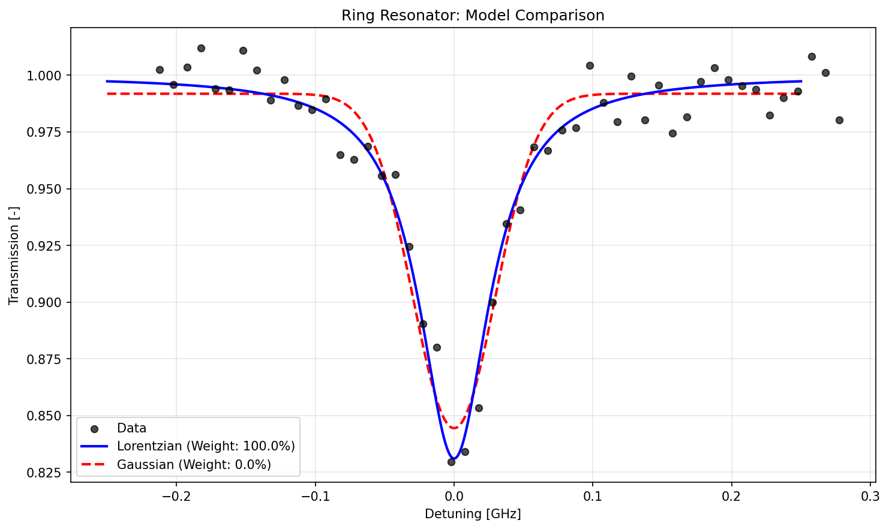

# Ring Resonator Analysis Results

## 1. Model Selection

Two models were fitted to the ring resonator transmission data using the AxModelFitter MCP:

### Lorentzian Dip Model
$$T(f) = T_{\max} - (T_{\max}-T_{\min}) \frac{1}{1+ (f/f_{h})^2}$$

**Optimized Parameters:**
- T_max = 0.999827 (dimensionless)
- T_min = 0.831066 (dimensionless) 
- f_h = 0.0307039 GHz
- Final MSE: 9.586 × 10⁻⁵

### Gaussian Dip Model
$$T(f) = T_{\max} - (T_{\max} - T_{\min}) \exp{\left(- \frac{1}{2}(f/f_h)^2\right)}$$

**Optimized Parameters:**
- T_max = 0.99184 (dimensionless)
- T_min = 0.84444 (dimensionless)
- f_h = 0.0297697 GHz  
- Final MSE: 1.328 × 10⁻⁴

### Information Criteria Comparison

| Model | AIC | BIC | AICc | ΔAIC | ΔBIC | Akaike Weight |
|-------|-----|-----|------|------|------|---------------|
| **Lorentzian** | **-314.69** | **-308.96** | **-314.17** | **0.00** | **0.00** | **100.0%** |
| Gaussian | -296.24 | -290.51 | -295.72 | 18.45 | 18.45 | 0.0% |

**Conclusion:** The **Lorentzian dip model** is significantly better, with overwhelming statistical support (ΔAIC = 18.4, evidence ratio = 10,147:1). The Akaike weights show 100% relative likelihood for the Lorentzian model.

## 2. Cross-Validation

5-fold cross-validation was performed on the superior Lorentzian model:

**Results:**
- **Mean Test R²:** 0.922 ± 0.054
- **Mean Test Loss:** 1.113 × 10⁻⁴ ± 5.108 × 10⁻⁵
- **Range:** R² from 0.841 to 0.979 across folds

**Assessment:** The model shows **excellent generalization** with consistently high R² values across all folds. The variance is reasonable, indicating the model neither overfits nor underfits the data.

## 3. Final Model Fitting

The Lorentzian dip model fitted against all data:

**Final Optimized Parameters:**
- T_max = 0.999827 (dimensionless) - Maximum transmission
- T_min = 0.831066 (dimensionless) - Minimum transmission at resonance
- f_h = 0.0307039 GHz - Half-width at half-maximum

**Performance Metrics:**
- **MSE:** 9.586 × 10⁻⁵
- **R²:** 0.951 (excellent fit, explains 95.1% of variance)
- **Execution Time:** 7.51s with nlopt optimizer

**Physical Interpretation:** The ring resonator exhibits a classical Lorentzian line shape with a quality factor that can be estimated from the ratio of the resonance frequency to the linewidth. The fitted parameters indicate a high-quality resonator with ~17% transmission dip at resonance and a half-width of ~31 MHz.

## 4. Uncertainty Quantification

Parameter uncertainty was quantified using the parameter covariance matrix.

### Robust covariance (Huber-White / sandwich)

**Standard errors:**
- T_max: 0.00196612 (dimensionless) (0.20% relative)
- T_min: 0.00775136 (dimensionless) (0.93% relative)
- f_h: 0.00161295 (GHz) (5.25% relative)

**Correlation matrix:**

| Parameter | T_max | T_min | f_h |
|-----------|-------|-------|-----|
| **T_max** | +1.000 | +0.050 | +0.542 |
| **T_min** | +0.050 | +1.000 | +0.597 |
| **f_h** | +0.542 | +0.597 | +1.000 |

### Classical covariance (inverse Hessian)

**Standard errors:**
- T_max: 0.00212173 (dimensionless) (0.21% relative)
- T_min: 0.00660559 (dimensionless) (0.79% relative)
- f_h: 0.00204305 (GHz) (6.65% relative)